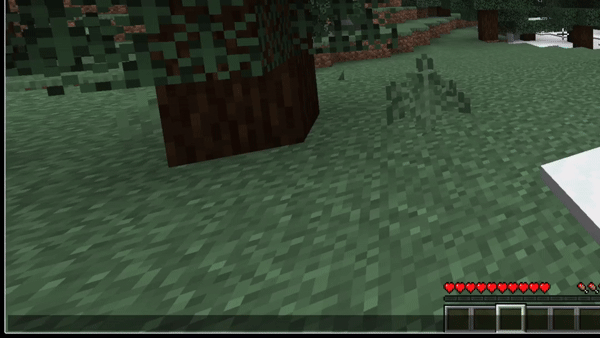

# `syn-sniff`

A plugin for Paper and Velocity that passively sniffs TCP/IP SYN packets to give deeper insight into player connections. 
This can be used to reveal information such as the Operating System or VPN.

## Requirements
- Java 21
- pcap native library (libpcap, WinPcap, Npcap)
- Administrator privileges or [Capabilities (Linux)](./docs/capabilities.md)

## Usage

| Command                 | Description                         | Permission                |
|-------------------------|-------------------------------------|---------------------------|
| `/fingerprint <player>` | View raw TCP/IP fingerprint info    | `synsniff.command-fingerprint`    |
| `/predictos <player>`   | Show the predicted operating system | `synsniff.command-predictos`      |

### Demo

## Installation (Without proxy)

First make Sure you meet all the [Requirements](#requirements)

If you run a single Paper server which is not running behind any proxy, follow these instructions to install the plugin.
Otherwise, view [Installation (proxy)](#installation-proxy)

1. Download the latest Jar ending in `-paper` from the [Releases](https://github.com/Duckulus/syn-sniff/releases) page.
2. Place the `.jar` into your servers `plugins/` directory
3. Start the server once to generate the default config
4. Open `plugins/SynSniff/config.yml` and configure the plugin
5. Restart the Server

⚠️ **Important:** In your config, you must set the correct network interface for your system.
**This is required for the plugin to work!** You can find interface names using  
`ip link show` (Linux/macOS) or `netsh interface show interface` (Windows).
You should the interface your server uses to connect to the internet or local network.

## Installation (proxy)

First make Sure you meet all the [Requirements](#requirements)

If your servers run behind a Velocity proxy, follow these instructions to install the plugin.
Otherwise, view [Installation (Without proxy)](#installation-without-proxy)

1. Download the latest Jar ending in `-velocity` from the [Releases](https://github.com/Duckulus/syn-sniff/releases) page.
2. Place the `.jar` into your servers `plugins/` directory
3. Start the server once to generate the default config
4. Open `plugins/syn-sniff/config.yml` and configure the plugin
5. Restart the Server

⚠️ **Important:** In your config, you must set the correct network interface for your system.
**This is required for the plugin to work!** You can find interface names using  
`ip link show` (Linux/macOS) or `netsh interface show interface` (Windows).
You should the interface your server uses to connect to the internet or local network.

## Developer API

We provide a simple API for plugin developers to access fingerprinting data.

Check out the [Wiki](https://github.com/Duckulus/syn-sniff/wiki/) for detailed documentation on installation and usage of the API.

## Todo

This project is under active development and there is plenty of room to contribute.

Below is a list of stuff that still needs to be done:

- [ ] More sophisticated OS prediction using more sample Records
- [ ] Support for IPv6
- [ ] Optional Persistence of Fingerprints
- [x] Velocity Support
- [x] More modular code structure possibly supporting different kinds of servers
- [x] API for plugin devs
